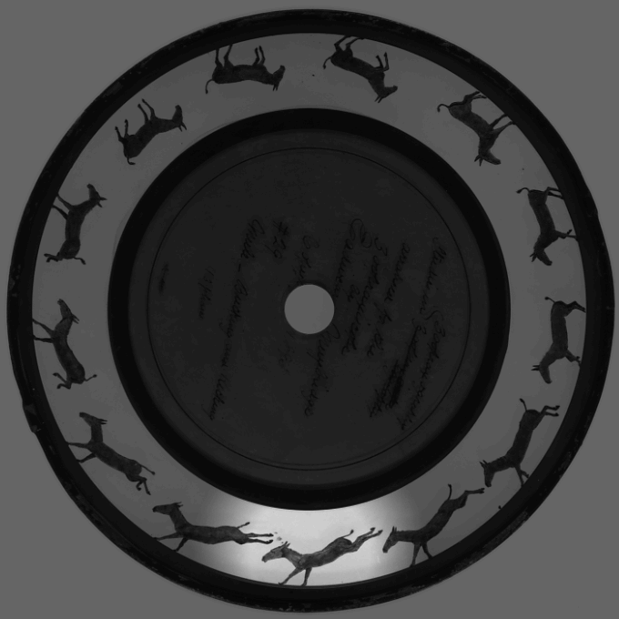

# Muybridge: Quantized 2.5D Network Fusion Pipeline for On-Device Human Pose Detection

<p align="center">
  
</p>

## Overview

**Muybridge** is a lightweight, edge-native perception pipeline that fuses:
1. **2D Pose Estimation (ElifPos, HALPE-26)**  
2. **Monocular Depth Estimation (Marigold)**  
3. **Fusion Module for 2.5D Center-of-Mass Tracking**

From a single RGB frame, the system produces **2D keypoints**, **relative depth map**, **Fused 2.5D keypoints and center-of-mass (COM) estimates (centroid + geometric-median variants)** to build **joint-centric 2.5D trajectories** that are suitable for biomechanics, gait analysis, and in-the-wild human monitoring — all while running in real-time from quantization, pruning, and Core ML export for efficient deployment on consumer hardware, iPhone.

## Features
- 🧍 **2D Keypoints** via ElifPose (26 HALPE joints).  
- 🔹 **Depth Maps** via Marigold diffusion-style UNet (with CLIP removed, lightweight conditioning).  
- 🔀 **2.5D Fusion**: Bilinear depth sampling at joints; back-projection with a simple pinhole model.
- 🎯 **Center of Mass Tracking**: 2D centroid & geometric median; 3D centroid & geometric median (projected to image plane).  
- ⚡ **Edge-Friendly**: INT8 quantized, FP16 path; quantization and export hooks (Core ML/ONNX), pruned models for on-device deployment.  
- 🧪 **Single entry point**: (`run_fuse.py`): single entrypoint to fuse pose + depth.

## Repository Structure
```bash
Muybridge/
│
├── depth_constructor/Marigold # Marigold depth estimation (submodule-style)
│ ├── marigold/ # Depth pipeline code
│ └── src/ # UNet, VAE, utilities
│
├── keypoint_estimator/ # ElifPose model & training scripts
│
├── tools/ # Wrappers for fusion
│ ├── depth_wrapper.py
│ ├── pose_wrapper.py
│ └── fuse_utils.py
│
├── fusion_inputs/ # Example RGB frames
├── fusion_outputs/ # Example pose + depth outputs
├── run_fuse.py # Main pipeline runner
└── README.md
```

## Quickstart (venv)

```bash
python3 -m venv muybridge-env
source muybridge-env/bin/activate
python -m pip install --upgrade pip wheel
pip install -r requirements.txt
```

### Data

```bash
# Place one or more images into fusion_inputs/:
fusion_inputs/
└─ sample.jpg  
```
### Run

```bash
python run_fuse.py \  
--pose-ckpt /home/youruser/Muybridge/keypoint_estimator/posestimation/elif_model/training/elif_pose_model.pth \
--marigold-checkpoint prs-eth/marigold-depth-v1-1 \ # (or local path see marigold README for setup)
--fp16
```


