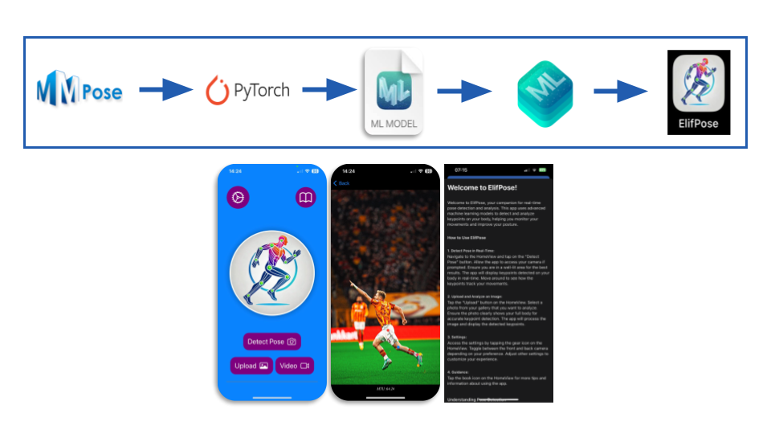

# ElifPose: TinyML Human Pose and MTU Length Estimation on iOS

[](https://pytorch.org/)
[](https://github.com/open-mmlab/mmpose)
[](https://developer.apple.com/documentation/coreml)
[](https://numpy.org/)
[](https://developer.apple.com/xcode/swiftui/)
[](https://developer.apple.com/documentation/avfoundation)
[](https://developer.apple.com/xcode/)
[](https://developer.apple.com/documentation/accelerate/vimage)
[](https://www.apache.org/licenses/LICENSE-2.0)

ElifPose is a lightweight and mobile-optimized human pose estimation framework designed to enable real-time prediction of Muscle-Tendon Unit (MTU) lengths for key muscle groups, such as the hamstrings and gastrocnemius, directly on-device. It employs a two-stage architecture that first uses a frozen RTMDet detector for efficient person localization, followed by a pose estimation network combining a CSPNeXt backbone with a transformer-enhanced RTMCC (Regression-based Transformer Model with Cross-Context) head. This network processes 256×192 person crops to predict 26 human keypoints with sub-pixel precision. These keypoints serve as input to MTU estimation formulas implemented in the mobile app: hamstring length is computed using the Hawkins and Hull (1989) equation based on hip and knee angles, while gastrocnemius length is derived from ankle and knee angles using an anatomically grounded model. The compact 9M-parameter model supports full training-to-deployment tooling, including pruning and CoreML export, and achieves 45.3 FPS on the latest iPhone Neural Engine making ElifPose well-suited for real-time biomechanics, rehabilitation, and fitness monitoring in resource-constrained environments.

**ElifPoseHighlights**

- 🚀 Mobile-First Performance: Achieves **45.3 FPS** on Apple’s Neural Engine. Uses **<9M parameters** and approximately **82MB FP32 memory**

- 📊 Strong Accuracy vs Lightweight Baselines: Outperforms **RTMPose** on AUC and PCK. Delivers **higher FPS** with a **smaller model size**

- 🔁 Integrated Two-Stage Pipeline: Utilizes a frozen **RTMDet** person detector followed by the **ElifPose** regression head:**RTMDet** Detects bounding boxes using a CSPNeXt-PAFPN structure. **ElifPose** crops person regions and predicts **26 keypoints** with a transformer-enhanced **SimCC** head

- 🛠️ Hardware-Aware Training & Deployment Stack: Supports **model pruning** (up to 30%) with minimal accuracy degradation. Includes **quantization-aware training (QAT)**. Enables full **PyTorch → CoreML** conversion via `coremltools`

- 📱 End-to-End System for iOS: Comes with a complete **Swift/Xcode iOS app**: Loads and runs the **CoreML model in real-time**. Fully compatible with **iOS 16+**, **Swift 5.5+**, and **Xcode 14+**


## Overview
The model is based on a lightweight CSPNeXt backbone with a RTMCC (Regression-based Transformer Model with Cross-Context) head, specifically designed for efficient pose estimation on mobile devices. 

The architecture includes:

CSPNeXt backbone feature extractor | Transformer-based pose decoder | Optimized mobile deployment

<div align="center">
  
</div>

## Repository Structure

The repository is organized into the following main folders:

1. `ElifPose`
This folder contains the **iOS application** that I have implemented. The app uses a trained machine learning model to perform pose estimation.

2. `Model files`
This folder contains the **trained machine learning models** and the **CoreML conversion script** used to convert the trained models into the CoreML format for integration into the iOS app.

3. `elif_model`
This folder holds the code used for **training the models**. It includes the necessary scripts and configurations for setting up and training the model from scratch.

4. `elif_pose_pruning`
In this folder, you'll find experiments related to **model pruning**, aimed at reducing the model size while maintaining accuracy. These experiments focus on optimizing the model for mobile deployment.

**For more detailed info about each folder, please refer to each folder's own readme file.**


## Quickstart (Pre-trained ElifPose model)

 1. Clone the repository
 ```bash
   git clone https://gitlab.com/lab2050544/projects/multisensor/applepose/posestimation.git
   cd Posestimation
   ```
 2. Open Posestimation/ in Xcode
 3. Select ElifPose.xcodeproj
 4. Build and run the app on an iPhone simualtior or run on a real device


## Full Usage

   ### Prerequisites

- Python 3.8+
- PyTorch 1.10+
- MMPose 1.0.0+
- CoreML Tools 6.0+

### Installation

1. **Clone the repository:**
```bash
git clone https://gitlab.com/lab2050544/projects/multisensor/applepose/posestimation.git
cd Posestimation
```
2. **Set up the environment:**
```bash
conda env create -f environment.yml
conda activate posest
```
3. **Install MMPose, and Xcode (must be on Apple device):**
```bash
pip install mmpose mmcv-full -f https://download.openmmlab.com/mmcv/dist/{cu_version}/{torch_version}/index.html
install Xcode from the App Store
```
See here for intalltion of mmpose: https://github.com/open-mmlab/mmpose

5. **DataSet placement:**
- Navigate to the root of your system to create the following dataset folder structure below, Note: this should **not be in posestimation folder and should beplace in parrellel with it**.
```bash
mkdir datasets/yourname for quick usage
mkdir datasets/annotations
mkdir datasets/COCO
mkdir datasets/Halpe
```
- navigate datasets and documentation section of this README and click on the COOC and HALPE links to naivagte to the forums
- download the datasets and annotations COCO and Halpe26 and add them to dataset/ and datasets/annotations dirs a lot of hte dirs will be created for youy from hte ZIP files you downloaded, the resulting structure should look like this:s

```bash
datasets/yourrootname/
├── COCO
│   ├── train2017/
│   ├── val2017/
│   ├── train2017.zip
│   ├── val2017.zip
│   └── annotations/
│       ├── coco_wholebody_train_v1.0.json
│       └── coco_wholebody_val_v1.0.json
└── Halpe
    ├── annotations/
    │   ├── halpe_train_v1.json
    │   └── halpe_val_v1.json
    ├── hico_20160224_det/
    │   ├── anno_bbox.mat
    │   ├── anno.mat
    │   ├── images/
    │   ├── README
    │   └── tools/
    └── hico_20160224_det.tar.gz
```
- *Refer to Troubleshooting below for issues with the datasets*

### Training

1. **Configure Training Parameters**:
*Hyperparameters can be updated in `elif_model/training/train.py`*:
```python
base_lr = 4e-3
train_batch_size = 512
val_batch_size = 64
max_epochs = 50
```

2. **Start Training**:
```bash
cd Posestimation/elif_model/training
python train.py --data-root /path/to/your/datasets
``` 
*Training uses a combination of COCO-WholeBody and Halpe datasets*
*Model checkpoints are saved in the checkpoints/ directory*

### Quantization and Pruning

1. **Model Pruning:**
```bash
python elif_pose_pruning/prune_model.py \
--weights path/to/checkpoint.pth \
--prune-ratio 0.3
```
*Reduces model size by 30% with minimal accuracy loss*
*Adjust prune-ratio based on your accuracy/performance requirements*

2. **Post-Training Quantization:**
```bash
cd Posestimation/elif_model/training
python quantize_model.py \
  --weights path/to/checkpoint.pth \
  --quantization-config path/to/quantization_config.json
```

### CoreML Conversion

**Convert PyTorch to CoreML:**

1. Open and run Model Files/CoreML Exporter.ipynb
- Loads the trained PyTorch model
- Converts it to CoreML format
- Optimizes for mobile deployment
- Saves as  Posestimation/ElifPoseModel.mlmodelc

### Deploying the iOS App

1. **Xcode Setup:**
- Open Posestimation/ElifPose.xcodeproj in Xcode
- Select your development team in the Signing & Capabilities tab and the depalymetns device in the device menu

2. **Run on Device:**
- Connect your iOS device (A12 Bionic or newer recommended)
- Select your device from the device menu
- Click the "Run" button or press Cmd+R

3. **Build for Distribution:**
- Select "Any iOS Device" as the target
- Go to Product > ArchiveOnce archived, click "Distribute App"

## Datasets and Documentation

### Datasets
- **[COCO-WholeBody Dataset](https://cocodataset.org/#download)**
- **[Halpe Dataset](https://github.com/Fang-Haoshu/Halpe-FullBody)**

### Documentation
- **[MMPose Documentation](https://mmpose.readthedocs.io/en/latest/)**
- **[Core ML Documentation](https://developer.apple.com/documentation/coreml/)**
- **[Swift / SwiftUI Documentation](https://developer.apple.com/documentation/swift)**

## Results and Benchmarks

### Runtime performance on-device  
*Measured on an iPhone 15 Pro (iOS 17.4) with a single 192 × 256 frame, Core ML compute units as indicated.*

| **Processing Unit** | **FPS**  |
|---------------------|----------|
| GPU                 | 12.7     |
| CPU                 | 24.5     |
| Neural Engine       | **45.3** |

### Accuracy vs. baseline  
*Evaluated on COCO-WholeBody + Halpe-26 (input 192 × 256).*

| **Model**    |  **FPS**  | **AUC**   |  **PCK**  |
|--------------|-----------|-----------|-----------|
| **ElifPose** |  **224**  | **0.902** | **73.32** |
| RTMPose      |    123    |   0.870   |  66.35 %  |


## Troubleshooting: Dataset Path Issues

If you see errors about missing files or dataset paths not matching, it's likely because the code expects your dataset directory to be in a specific location. By default, the training and QAT scripts look for your data at a path like:

```
/datasets/yourusername/
```
parallel to your home/project directory (not inside your project folder).

**If your datasets are somewhere else, or your username/folder structure is different, set the `DATASETS_ROOT` environment variable to point to your dataset root.**

For example:
```bash
export DATASETS_ROOT=/path/to/your/datasets/yourusername
```

You can also edit the `DATASETS_ROOT` logic in `train.py`, `QAT_train.py`, or any config/model file if your setup is unique.

**Tip:** Always double-check your dataset folder structure and the root path being printed by the script. Adjust as needed so the code can find your data!

## License

Licensed under the Apache License, Version 2.0 (the "License");
you may not use this file except in compliance with the License.
You may obtain a copy of the License at

    http://www.apache.org/licenses/LICENSE-2.0

Unless required by applicable law or agreed to in writing, software
distributed under the License is distributed on an "AS IS" BASIS,
WITHOUT WARRANTIES OR CONDITIONS OF ANY KIND, either express or implied.
See the License for the specific language governing permissions and
limitations under the License.

## Citation

If you use Posestimation in your research, please cite:

## Acknowledgements

We gratefully acknowledge the authors and maintainers of the above datasets, frameworks, and documentation for making their resources publicly available.


